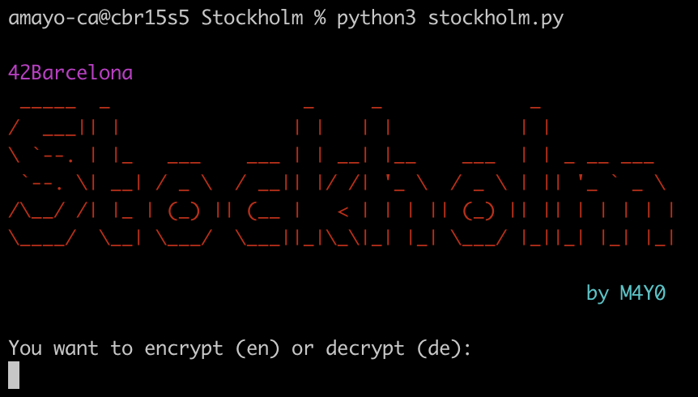

# 🦠 Stockholm

## Descripción

◦ Este proyecto consiste en desarrollar un ransomware capaz de encriptar y desencriptar todos los archivos afectados por WannaCry

◦ El ransomware encripta el contenido de los archivos, el nombre y su path mediante Fernet y añade la extensión .ft para que no se pueda distingir entre un  archivo u otro

◦ Este ransomware afecta a los archivos de la carpeta '~/infection' y sus subcarpetas.

◦ Este malware infecta solamente a sistemas basados en Debian


## Uso

#### 💻 Ejecutar el programa:

```bash
python3 stockholm.py
```



### 🚩 Flags del Programa

```bash
-h / --help: Para ver las flags que se permiten en el programa y para qué sirven
-v / --version: Para saber la versión del programa en la que estas
-r / --reverse: Para introducir la clave de desencriptado como parámetro
-s / --silent: para no mostrar por pantalla los archivos que se están encriptando
```
